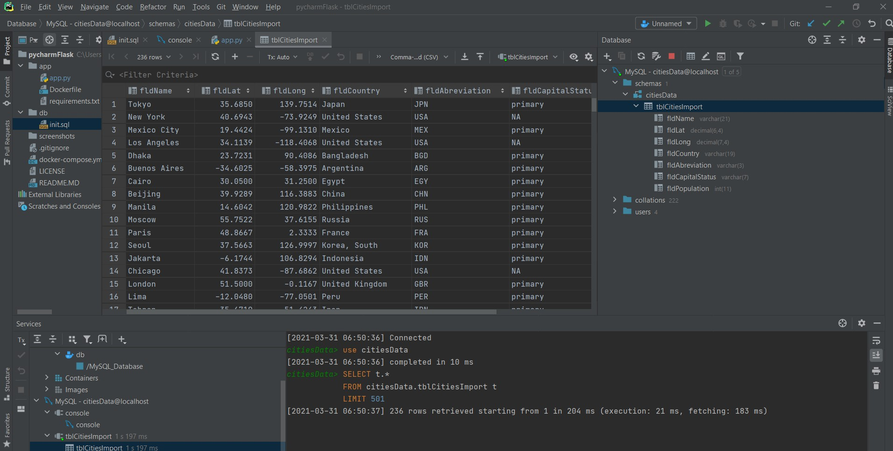
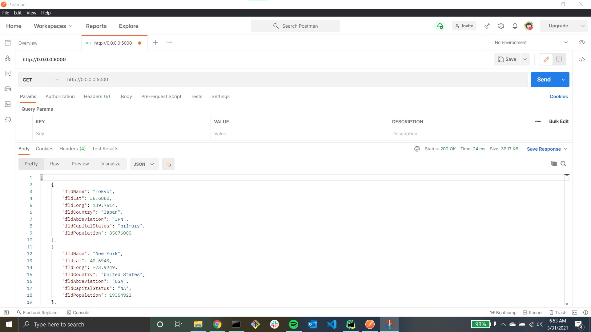
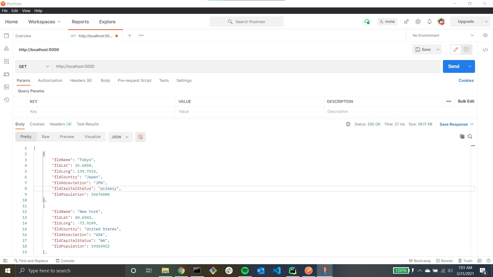
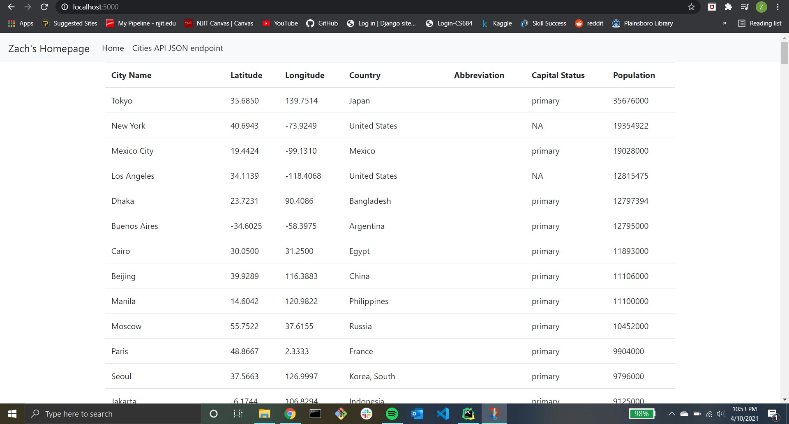
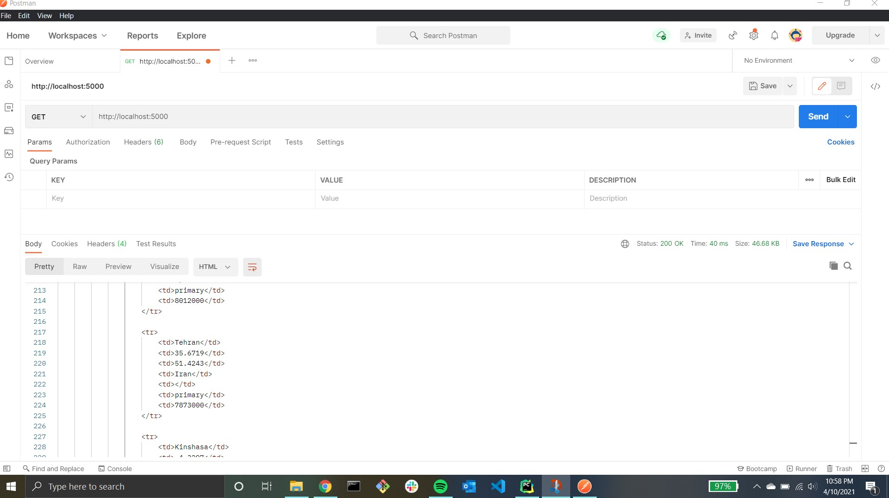

# Project Description
This project is a homework assignment to teach how to get Pycharm setup with Docker, Flask, and MySQL
# MySQL Database

# Postman Screenshot

# Postman Screenshot (with localhost:5000)

# Formatted Index Page 

# Formatted Postman Output

